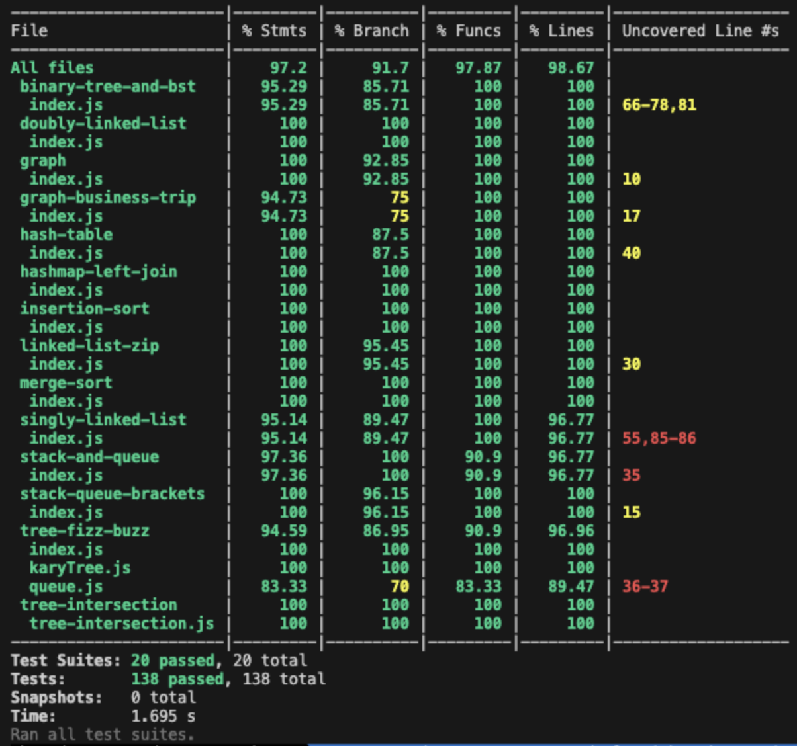
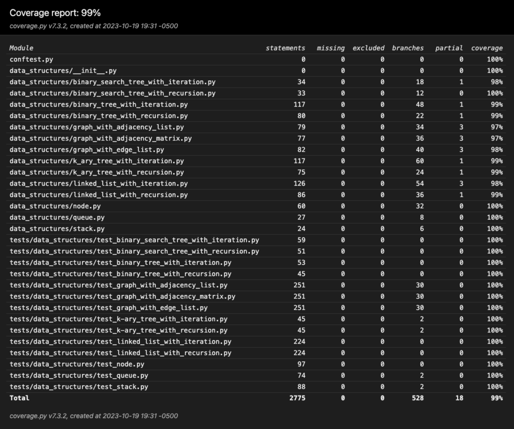

# Data Structures and Algorithms

These are my implementations of common data structures and algorithms, currently available in the following languages:

- [JavaScript](#javascript)
- [Python](#python)

Full test suites and [test coverage reports](#testing) are included.

## JavaScript

### Data Structures

- [Singly Linked List](javascript/singly-linked-list/README.md)
- [Doubly Linked List](javascript/doubly-linked-list/README.md)
- [Stack and Queue](javascript/stack-and-queue/README.md)
- [Binary Tree, Binary Search Tree, and K-ary Tree with Depth First Traversal (Pre-Order, In-Order, and Post-Order)](javascript/binary-tree-and-bst/README.md)
- [Hash Table](javascript/hash-table/README.md)
- [Directed Graph - Using Adjacency List](javascript/graph/README.md)

### Algorithms

- [Insertion Sort](javascript/insertion-sort/README.md)
- [Merge Sort](javascript/merge-sort/README.md)
- [Zip Two Linked Lists](javascript/linked-list-zip/README.md)
- [Validate Brackets](javascript/stack-queue-brackets/README.md)
- [Tree Fizz Buzz](javascript/tree-fizz-buzz/README.md)
- [Tree Intersection](javascript/tree-intersection/README.md)
- [Hash Map Left Join](javascript/hashmap-left-join/README.md)
- [Business Trip - Traversing A Weighted, Directed Graph](javascript/graph-business-trip/README.md)

## Python

### Data Structures

- [Singly Linked List - Fully Iterative](python/data_structures/linked_list_with_iteration.py)
- [Singly Linked List - Fully Recursive](python/data_structures/linked_list_with_recursion.py)
- [Stack](python/data_structures/stack.py)
- [Queue](python/data_structures/queue.py)

### Algorithms

## Testing

### JavaScript

From the `javascript` directory:

- Run `npm test` to run the full test suite for JavaScript implementations.

### Python

From the `python` directory:

- Run `coverage run -m pytest` to run the full test suite for Python implementations.
- Run `open htmlcov/index.html` after running the test suite to see the coverage report in the browser.
- Run `coverage run -m pytest -k <test_name>` to run an individual test.

