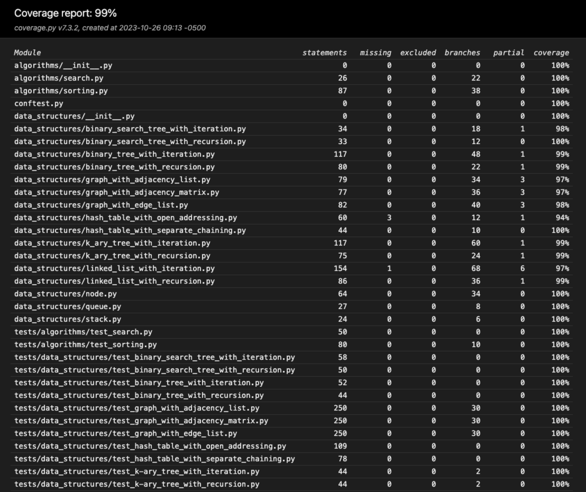
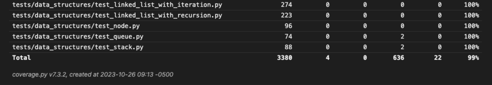
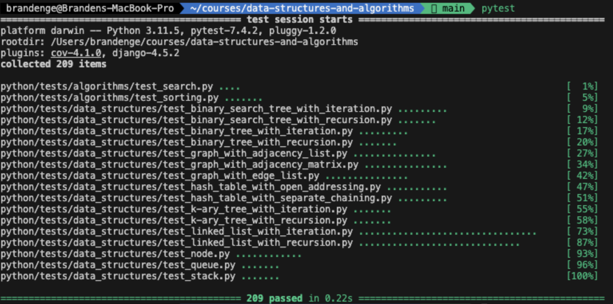

# Data Structures and Algorithms

These are my node-based implementations of common [data structures](#data-structures) and [algorithms](#algorithms).

All implementations are done in [Python](#python), with some additional implementations also available in [JavaScript](#javascript).

Also includes full test suites and [test coverage reports](#testing) using Pytest and Jest, respectively.

Features:

- Multiple different implementations of many data structures, including graphs (using an [edge list](python/data_structures/graph_with_edge_list.py), an [adjacency list](python/data_structures/graph_with_adjacency_list.py), and an [adjacency matrix](python/data_structures/graph_with_adjacency_matrix.py)), and hash tables (using [separate chaining/open hashing](python/data_structures/hash_table_with_separate_chaining.py), and [open addressing/closed hashing](python/data_structures/hash_table_with_open_addressing.py)).
- Both iterative and recursive implementations of:
  - Binary Trees - [iterative](python/data_structures/binary_tree_with_iteration.py), [recursive](python/data_structures/binary_tree_with_recursion.py)
  - Binary Search Trees - [iterative](python/data_structures/binary_search_tree_with_iteration.py), [recursive](python/data_structures/binary_search_tree_with_recursion.py)
  - K-ary Trees - [iterative](python/data_structures/k_ary_tree_with_iteration.py), [recursive](python/data_structures/k_ary_tree_with_recursion.py)
  - Linked Lists - [iterative](python/data_structures/linked_list_with_iteration.py), [recursive](python/data_structures/linked_list_with_recursion.py)
  - Also including:
    - [Iterative version of DFS](python/data_structures/binary_tree_with_iteration.py) for binary trees.
    - [Recursive version of BFS](python/data_structures/binary_tree_with_recursion.py) for binary trees.
    - Delete methods for BST, binary tree, or k-ary tree, both iteratively and recursively.
    - Examples of recursive implementations extracting the recursive logic into the [Node class](python/data_structures/node.py) (for [linked lists in Python](python/data_structures/linked_list_with_recursion.py)).
    - Examples of recursive implementations keeping the recursive logic in the respective data structure (for [binary trees in Python](python/data_structures/binary_tree_with_recursion.py)).
- Multiple implementations of [quicksort](python/algorithms/sorting.py):
  1) Simplified
  2) Using Lomuto's partitioning
  3) Using Hoare's partitioning

## Python

### Data Structures

#### Graphs

- [Graph - with Adjacency Matrix](python/data_structures/graph_with_adjacency_matrix.py)
- [Graph - with Adjacency List](python/data_structures/graph_with_adjacency_list.py)
- [Graph - with Edge List](python/data_structures/graph_with_edge_list.py)

#### Hash Tables

- [Hash Table - with Open Addressing/Closed Hashing](python/data_structures/hash_table_with_open_addressing.py) - with double hashing for the probe sequence
- [Hash Table - with Separate Chaining/Open Hashing](python/data_structures/hash_table_with_separate_chaining.py) - with linked lists for each bucket

#### Trees

- [K-ary Tree - Fully Recursion](python/data_structures/k_ary_tree_with_recursion.py)
- [K-ary Tree - Fully Iterative](python/data_structures/k_ary_tree_with_iteration.py)
- [Binary Search Tree - Fully Recursive](python/data_structures/binary_search_tree_with_recursion.py)
- [Binary Search Tree - Fully Iterative](python/data_structures/binary_search_tree_with_iteration.py)
- [Binary Tree - Fully Recursive](python/data_structures/binary_tree_with_recursion.py)
- [Binary Tree - Fully Iterative](python/data_structures/binary_tree_with_iteration.py)

#### Linear Data Structures

- [Singly Linked List - Fully Iterative](python/data_structures/linked_list_with_iteration.py)
- [Singly Linked List - Fully Recursive](python/data_structures/linked_list_with_recursion.py)
- [Stack](python/data_structures/stack.py) - with node-based implementation
- [Queue](python/data_structures/queue.py) - with node-based implementation

### Algorithms

#### Searching

[Search Algorithms](python/algorithms/search.py)

- Linear Search
- Binary Search

#### Sorting

[Sorting Algorithms](python/algorithms/sorting.py)

- Bubble Sort
- Selection Sort
- Insertion Sort
- Merge Sort
- Quicksort, with a simplified implementation and a random pivot
- Quicksort, with Lomuto partitioning and Sedgewick's median-of-three pivot choice
- Quicksort, with Hoare partitioning and 2 different versions with different pivot choices

#### Other

- [Fibonacci Sequence](python/algorithms/fibonacci.py) - using dynamic programming in different variations, including memoization via a closure and a space-optimized, bottom-up iterative approach.
- [Generators](python/algorithms/generator.py)

#### To Do List

- Additional implementations for finding the height of a tree
- Additional implementations for finding the depth of a node in a tree
- Additional implementations for validating if a tree is balanced
- Quickselect (search)
- Golomb Sequence
- Unique paths problem
- Dynamic Array
- Array-based implementations of trees
- Priority Queue
- Double-ended Queue
- Binary Heap
- Trie
- Dijkstra's algorithm
  - using an array for unvisited nodes (simplified implementation)
  - using a priority queue for unvisited nodes (optimized implementation)
- Bellman-Ford algorithm (for weighted graph with negative weights)
- Advanced Graph
  - Bidirectional sort
  - Topological sort
  - Minimum spanning tree (MST)
  - Floyd-Warshall algorithm
  - Graph coloring
- Red-Black Tree (self-balancing with rotation operations)
- AVL (Adelson-Velsky and Landis) Tree (fully self-balancing with rotation operations, either single rotation - left and right, or double rotation - left-right and right-left)
- Heapsort
- Timsort
- Radix sort
- Counting sort
- Shellsort
- Binary space partitioning tree

## JavaScript

### Data Structures

#### Graphs

- [Directed Graph - Using Adjacency List](javascript/graph/README.md)

#### Hash Tables

- [Hash Table](javascript/hash-table/README.md)

#### Trees

- [Binary Tree, Binary Search Tree, and K-ary Tree with Depth First Traversal (Pre-Order, In-Order, and Post-Order)](javascript/binary-tree-and-bst/README.md)

#### Linear Data Structures

- [Doubly Linked List](javascript/doubly-linked-list/README.md)
- [Singly Linked List](javascript/singly-linked-list/README.md)
- [Stack and Queue](javascript/stack-and-queue/README.md)

### Algorithms

#### Sorting

- [Merge Sort](javascript/merge-sort/README.md)
- [Insertion Sort](javascript/insertion-sort/README.md)

#### Other

- [Business Trip - Traversing A Weighted, Directed Graph](javascript/graph-business-trip/README.md)
- [Hash Map Left Join](javascript/hashmap-left-join/README.md)
- [Tree Intersection](javascript/tree-intersection/README.md)
- [Tree Fizz Buzz](javascript/tree-fizz-buzz/README.md)
- [Validate Brackets](javascript/stack-queue-brackets/README.md)
- [Zip Two Linked Lists](javascript/linked-list-zip/README.md)

## Testing

### Python

From the `python` directory:

- Run `pytest` or `coverage run -m pytest` to run the full test suite for Python implementations.
- Run `open htmlcov/index.html` after running the test suite to see the coverage report in the browser.
- Run `coverage run -m pytest -k <test_name>` to run an individual test.

### JavaScript

From the `javascript` directory:

- Run `npm test` to run the full test suite for JavaScript implementations.

## Notes To Self

- Many data structure methods require direct access to node objects. Instead of abstracting away the node class for reuse, try coupling separate node classes to each data structure class in future implementations. This might improve encapsulation of the data structure class.
