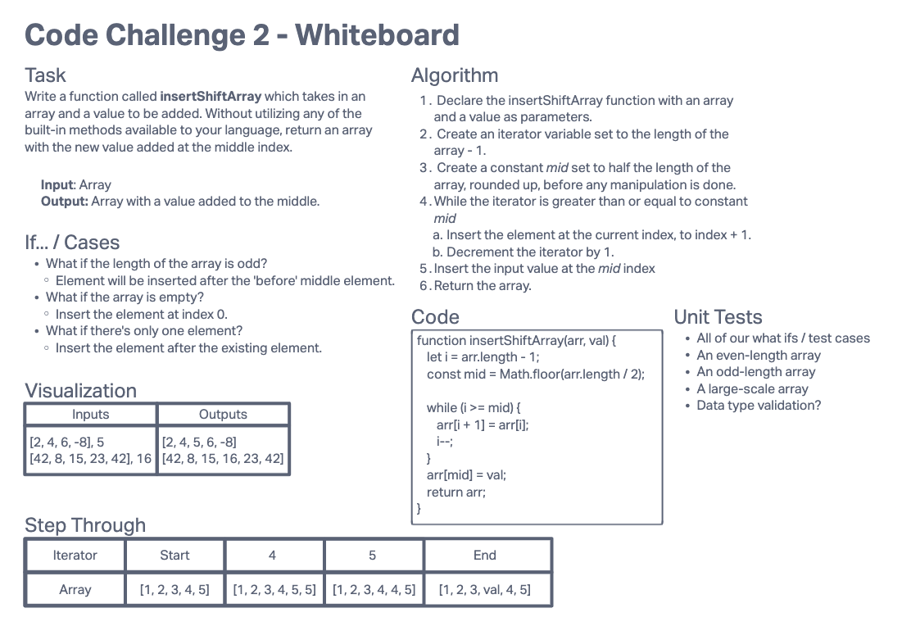

# Insert to Middle of an Array

Write a second function that removes an element from the middle index and shifts other elements in the array to fill the new gap.

## Whiteboard Process

## Approach & Efficiency

- O(n) linear time complexity because we have to iterate over half of the array.
- O(1) constant space complexity because we are modifying the array in-place (i.e. mutating it/it is destructive operation). Also because we only need to save 2 variables with primitive values that are unaffected by the length of the array.
- If we did not want to modify the array in-place, then it would be O(n) linear space complexity as we would have to make a copy of the array.
