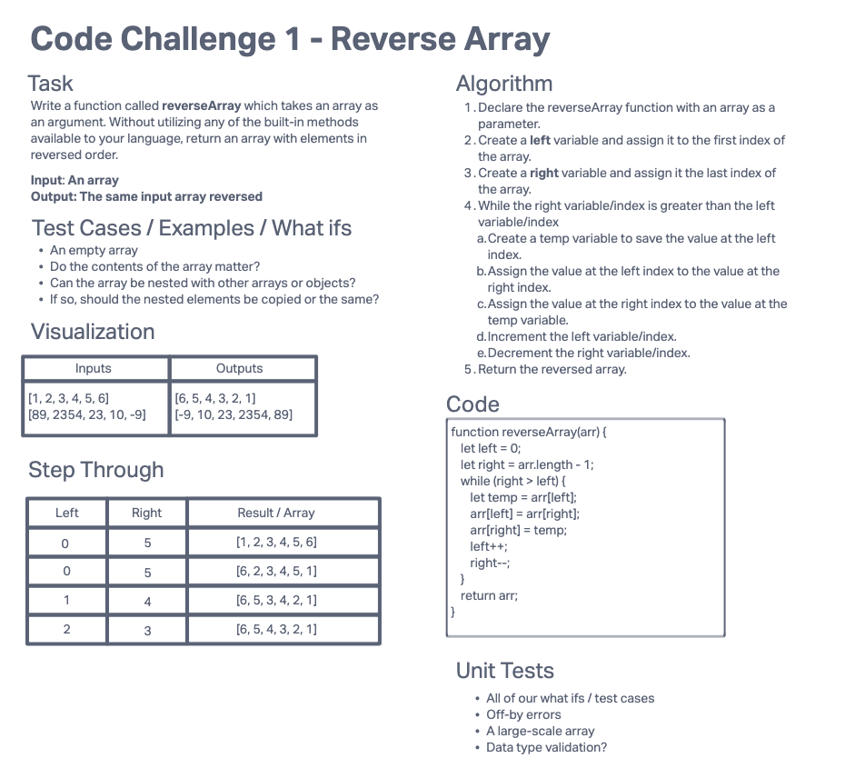

# Reverse an Array

Write a function called reverseArray which takes an array as an argument. Without utilizing any of the built-in methods available to your language, return an array with elements in reversed order.

## Whiteboard Process

## Approach & Efficiency

- O(n) time complexity because we have to iterate over half of the array.
- O(1) space complexity, because the array is modified in-place (i.e. mutated/destructive).
- If not modified in place, it would be O(n) space complexity, because a copy would have to be made.
