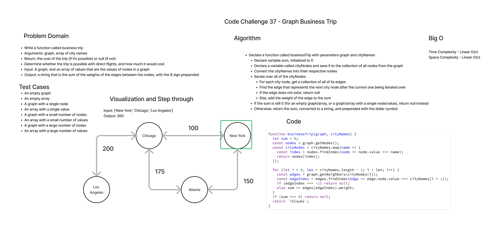

# Graph Business Trip

This is an implementation of a function that will identify the sum of weighted edges between a collection of connected nodes.

## Challenge Summary

- Write a function called business trip
- Arguments: graph, array of city names
- Return: the cost of the trip (if it’s possible) or null (if not)
- Determine whether the trip is possible with direct flights, and how much it would cost.

## Whiteboard Process

## Approach & Efficiency

- Time Complexity: Linear - O(n)
- Space Complexity: Constant - O(1)

## Solution

Example:

[Code Challenge 27 Example Graph Diagram](code-challenge-37-example.png)

- Input: [Metroville, Pandora] - Output: $82
- Input: [Arendelle, Monstropolis, Naboo] - Output: $115
- Input: [Naboo, Pandora] - Output: null
- Input: [Narnia, Arendelle, Naboo] - Output: null

[Link to Code](index.js)

Run the test file with the command: `npm test __tests__/graph-business-trip.test.js` from the `graph-business-trip` directory.

Credits:

- Code Fellows for example diagram, and sample inputs, and outputs.
