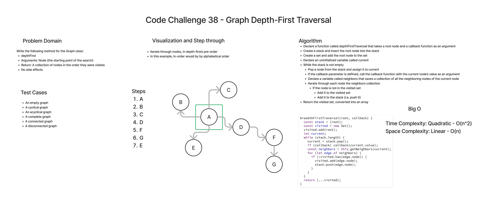

# Graph Depth First Traversal

This is an implementation of depth-first traversal of a graph data structure.

[Link to Code](index.js)

## Challenge

Write the following method for the Graph class:

- depthFirstTraversal
- Arguments: Node (the starting point of the search)
- Return: A collection of nodes in their pre-order depth-first traversal order

## Approach & Efficiency

depthFirstTraversal

- Time Complexity: Linear "O(V + E), where V is the number of vertices and E is the number of edges in the graph."
- Space Complexity: Linear O(n)

## Solution / Whiteboard

Credits:

- [Code Fellows Demo Code](https://github.com/codefellows/seattle-code-javascript-401d48/blob/main/class-35/inclass-demo/index.js)
- [Geeks for Geeks](https://www.geeksforgeeks.org/iterative-depth-first-traversal/)
