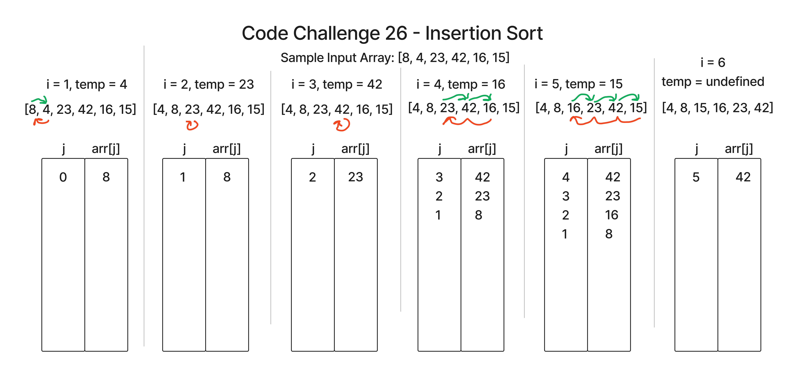

# Insertion Sort

This is an implementation of a function that performs an insertion sort operation.

[Link to Code](./index.js)

## Pseudo Code

```pseudocode
  InsertionSort(int[] arr)

    FOR i = 1 to arr.length

      int j <-- i - 1
      int temp <-- arr[i]

      WHILE j >= 0 AND temp < arr[j]

        arr[j + 1] <-- arr[j]
        j <-- j - 1

      arr[j + 1] <-- temp
```

Pseudocode Source: Code Fellows

## Trace

The general idea of the algorithm is that we separate the array into a sorted section and an unsorted section. The current element being evaluated is in the middle between the two sections, and starts from the left, moving to the right by 1 for each iterations. Therefore, the sorted section grows by 1 and and the unsorted section shrinks by 1 until the entire array has been iterated through and thus completing the sorting. The current value being checked is saved into a temp variable in anticipation of it being "inserted" (hence the name insertion sort) at the correct index.

Upon each iteration, the current index/value being checked is compared to the previous index to determine if it is sorted or not. If it is sorted, then the value stays in place, and the next iteration in the for loop proceeds. If it is not sorted, then the previous value is moved forward an index, and the next prior value is also checked to compare against the current value (which is saved in the temp variable). This process continues within a while loop until either a comparison is made that identifies the correct index for the current value to be inserted into, or the beginning of the array is reached (in which case, the current value gets insert into index 0).



### Iteration/Pass 1

i = 1, temp = 4

The temp variable with value of 4 (taken from index 1) gets compared to index 0 with value of 8. This is not sorted, so the value 8 gets moved forward an index. We then hit the beginning of the array, so the temp value of 4 gets inserted into index 0. This is effectively a swap.

### Iteration/Pass 2

i = 2, temp = 23

The temp variable with value of 23 (taken from index 2) gets compared to the previous index of 1, which currently has a value of 8. This is already sorted, so the temp value of 23 gets re-inserted back into its same index of 2, resulting in no change.

### Iteration/Pass 3

i = 3, temp = 42

The temp variable with value of 42 (taken from index 3) gets compared to the previous index of 2, which currently has a value of 23. Again, this is already sorted, so the temp value of 42 gets re-inserted back into its same index of 3, resulting in no change.

### Iteration/Pass 4

i = 4, temp = 16

The temp variable with value of 16 (taken from index 4) gets compared to the previous index of 3, which currently has the value of 42. This is not sorted, so 42 gets moved forward an index, and the next prior index is compared at index 2, which has a value of 23. This is also not sorted, so 23 gets moved forward an index, and the next prior index is compared at index 1, which has a value of 8. 8 is less than 16, so 16 is inserted at the last prior index evaluated (index 1) plus 1, resulting in index 2.

### Iteration/Pass 5

i = 5, temp = 15

The temp variable with value of 15 (taken from index 5) gets compared to the previous index of 4, which currently has the value of 42. This is not sorted, so 42 gets moved forward an index, and the next prior index is compared at index 3, which has a value of 23. This is also not sorted, so 23 gets moved forward an index, and the next prior index is compared at index 2, which has a value of 16. This is also not sorted yet, so 16 gets moved forward an index and the next prior index is compared at index 1 which has a value of 8. 8 is less than 15, so 15 is inserted at the last prior index evaluated (index 1) plus 1, resulting in index 2.

### Iteration/Pass 6

i = 6, temp = undefined

Here the outer loop finally breaks its condition by meeting or exceeding the length of the array, and so we do not enter an actual 6th iteration. The algorithm has now completed.

## Efficiency

Time Complexity: Quadratic - O(n ^ 2)

Space Complexity: Constant - O(1), because the input array is being mutated in-place (i.e. it is a destructive operation) and not copied.
