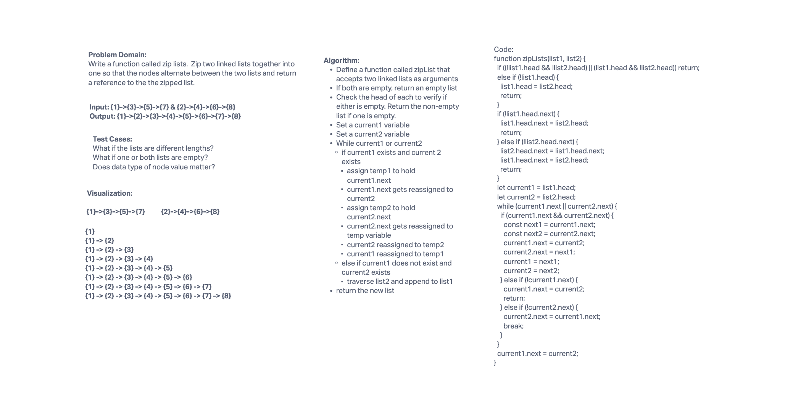

# Zip Linked Lists

This implements a function for merging 2 lists together (the 2nd merged into the 1st), with alternating nodes between the 2 lists (like a zipper).

## Challenge

- Write a function called `zipLists` that zip 2 linked lists together.
- Create tests for all use cases and pass all tests.

## Approach & Efficiency

zipList:

- Time Complexity: Linear O(n) because we iterate through at least twice as many nodes as the shorter linked list. Therefore, time increases with the number of nodes in the shorter linked list.
- Space Complexity: Constant O(1) because we are mutating the lists destructively in-place. We are not creating a new copy.

## API

zipList:

- Arguments: 2 linked lists.
- Returns: nothing. It mutates both linked lists in place, with the 1st linked list always holding the result of the operation. Therefore, the 2nd linked list is always merged into the 1st linked list. The 2nd linked list is destroyed after the operation, later to be garbage collected.

## Whiteboard

