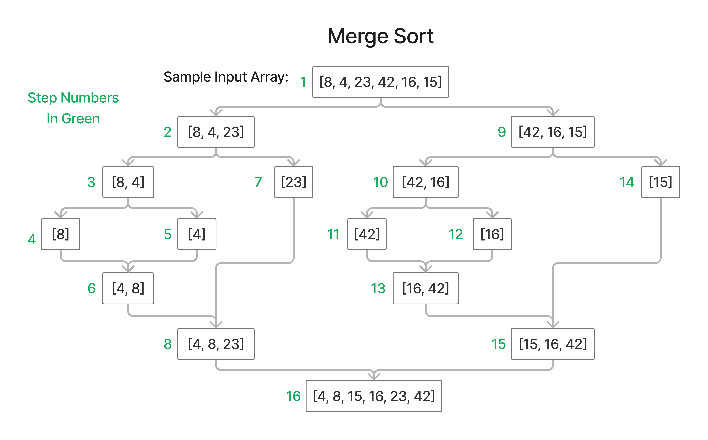

# Insertion Sort

This is an explanation and implementation of a merge sort algorithm.

[Link to Code](./index.js)

## Pseudo Code

```pseudocode
ALGORITHM Mergesort(arr)
    DECLARE n <-- arr.length

    if n > 1
      DECLARE mid <-- n/2
      DECLARE left <-- arr[0...mid]
      DECLARE right <-- arr[mid...n]
      // sort the left side
      Mergesort(left)
      // sort the right side
      Mergesort(right)
      // merge the sorted left and right sides together
      Merge(left, right, arr)

ALGORITHM Merge(left, right, arr)
    DECLARE i <-- 0
    DECLARE j <-- 0
    DECLARE k <-- 0

    while i < left.length && j < right.length
        if left[i] <= right[j]
            arr[k] <-- left[i]
            i <-- i + 1
        else
            arr[k] <-- right[j]
            j <-- j + 1

        k <-- k + 1

    if i = left.length
       set remaining entries in arr to remaining values in right
    else
       set remaining entries in arr to remaining values in left
```

Pseudocode Source: Code Fellows

## Trace

The merge sort algorithm uses the "divide and conquer" approach to solving the problem of sorting an array. It does this by recursively splitting the array into 2 halves until it reaches a base of an array with either 0 or 1 element remaining in the array. An array with 0 or 1 element in it is already sorted.

The algorithm then enters a 2nd phase after the recursive calls where it begins to merge the halves of the arrays back together into a new array in sorted order as the recursive calls unwind, resulting in a final sorted array at the end when the recursive calls have fully unwound.



Below is a description of each step from the above diagram (the green numbers in the diagram)

Steps:

1) The initial starting array
2) The first halvening - left half. Since this has more than 1 element remaining, another recursive halvening will happen after this.
3) The second halvening - left half of the left half. Since this has more than 1 element remaining, another recursive halvening will happen after this.
4) The third halvening - left half of the left half of the left half. This hits the base case since it has only 1 element remaining, so it will end its recursive call here.
5) The third halvening - right half of the left half of the left half. This hits the base case since it has only 1 element remaining, so it will begin merging after this.
6) The first merging and sorting of the left half of the left half.
7) The second halvening - right half. This hits the base case since it has only 1 element remaining, so it will begin merging after this.
8) The second merging and sorting of the left half.
9) The first halvening - right half. Since the this has more than 1 element remaining, another recursive halvening will happen after this.
10) The second halvening - left half of the right half. Since this has more than 1 element remaining, another recursive halvening will happen after this.
11) The third halvening - left half of the left half of the left half. This hits the base case since it has only 1 element remaining, so it will end its recursive call here.
12) The third halvening - right half of the left half of the right half. This hits the base case since it has only 1 element remaining, so it will begin merging after this.
13) The first merging and sorting of the left half of the right half.
14) The second halvening - right half of the right half. This hits the base case since it has only 1 element remaining, so it will begin merging after this.
15) The second merging and sorting of the right half.
16) The third and final merging and sorting of the original array.

## Efficiency

Time Complexity: Loglinear - O(n log n) - halving the array is log n, multiplied by iterating through the halves which is n.

Space Complexity: Linear - O(n) - merge sort requires creating a new array for the merging operation, which will be the same length of the starting input array. It is NOT mutating the array in-place and thus is NOT a destructive operation.
