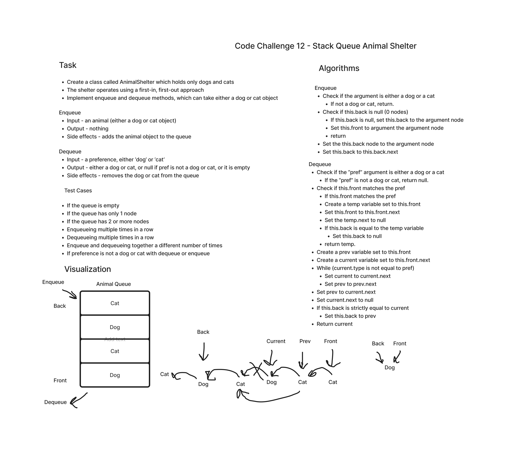

# Stack Queue Animal Shelter

Implement a queue that can handle 2 different types of objects called `cats` and `dogs` and is able to dequeue either type of object by preference, selecting the oldest one by type, or regardless of type.

[Link to Code](./index.js)

## Challenge

- Create a `Node` class with `value` and `next` properties.
- Create a `Stack` class with a `top` property, and write class instance methods for `push`, `pop`, `peek`, and `isEmpty`.
- Create a `AnimalShelter` class with `front` and `back` properties (like a queue), and write class instance methods for `enqueue`, and `dequeue`.
- Create tests for all methods and pass all tests.

## Approach & Efficiency

enqueue

- Time and Space Complexity: Constant O(1).

dequeue

- Time Complexity: Linear O(n).
- Space Complexity: Constant O(1).

## API

enqueue

- Argument: an animal object.
- Returns: nothing.
- Side effects: adds a node with a value to the back of the queue.

dequeue

- Argument: A preference.
- Returns: the value at the front of the queue.
- Side effects: Removes the front node from the queue.

## Whiteboard

