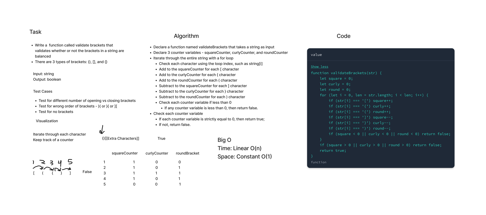

# Stack Queue Brackets

Write a function that validates whether or not the round, square, and curly brackets in a string are balanced.

[Link to Code](index.js)

## Challenge

- Create a `validatesBrackets` function that takes a string as an input and returns a boolean value.
- Validate whether the square, round, and curly brackets in the input string are balanced (i.e. `[]`, `()`, and `{}`).
- The order of the brackets is important to account for nestings.
- Create tests all use cases and pass all tests.

## Approach & Efficiency

- Time Complexity: Linear O(n).
- Space Complexity: Linear O(n). This is because the input is a string, which is a primitive value that is pass by value, and the length of which expands its memory use linearly.

## API

validateBrackets

- Input: A string containing square, round, or curly brackets.
- Output: A boolean, representing whether the brackets in the string are balanced or not.
- Side effects: none.

## Whiteboard

