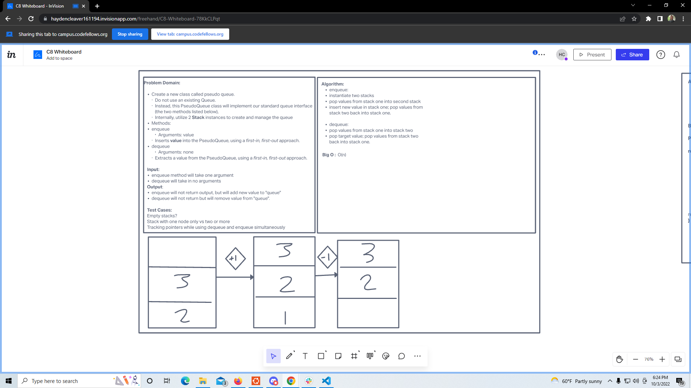

# PseudoQueue with Stacks

Implement a Queue using two Stacks.

[Link to Code](./index.js)

## Challenge

- Create a `Node` class with `value` and `next` properties.
- Create a `Stack` class with a `top` property, and write class instance methods `push`, `pop`, and `peek` for it.
- Create a `PseudoQueue` class with `front` and `back` properties, and write class instance methods `enqueue` and `dequeue` for it.
- Implement the `PseudoQueue` class by using two stacks.
- Create tests for all methods and pass all tests.

## Approach & Efficiency

enqueue

- Time and Space Complexity: Constant O(1).

dequeue

- Time and Space Complexity: Linear O(n).

## API

enqueue

- Argument: a value.
- Returns: nothing.
- Side effects: adds a node with a value to the back of the pseudo queue.

dequeue

- Argument: nothing.
- Returns: the value at the front of the pseudo queue.
- Side effects: Removes the front node from the pseudo queue.

## Whiteboard

