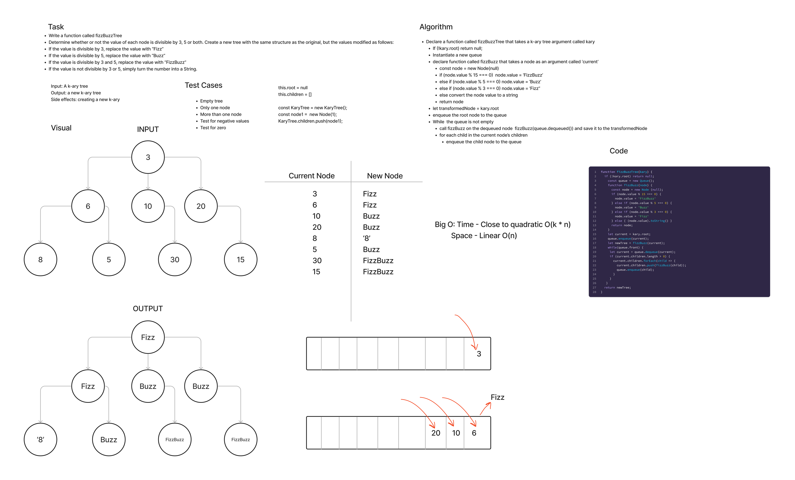

# Tree Fizz Buzz

This is an implementation of a function that runs the "FizzBuzz" algorithm on each node of a k-ary tree, and traversing the tree using breadth-first traversal (BFS).

[Link to Code](./index.js)

## Challenge Summary

- Create a `KaryNode` class with `value` and `children` properties.
- Create a `KaryTree` class.
- Create a `Queue` class with `front` and `back` properties, and `enqueue` and `dequeue` methods. To be used for breadth-first search.
- Create a function called `fizzBuzzTree` that performs FizzBuzz on the value of every node of a k-ary tree that is passed to it as an argument, and creates a new k-ary tree in the process.

### Whiteboard Process

## Approach & Efficiency

fizzBuzzTree

- Time Complexity: Quasi-Quadratic Big O(n * k).
- Space Complexity: Linear Big O(n) - because we are creating a new copy of a k-ary tree.

## Solution

- Run `npm test tree-fizz-buzz/__tests__` from the `JavaScript` directory.

## API

fizzBuzzTree

- Arguments: a k-ary tree
- Returns: a new k-ary tree
- Side Effects: none. Creates a new copy of the k-ary tree with modifications. It does not mutate in-place (it is a non-destructive method).
