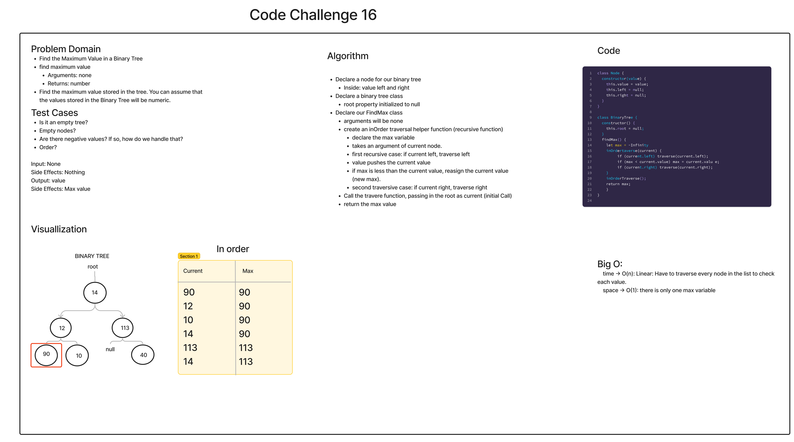

# Tree Max

This is an implementation of a function that finds the maximum value in a binary tree.

[Link to Code](./index.js)

## Challenge Summary

- Create a `BinaryNode` class with `value`, `left`, and `right` properties.
- Create a `BinaryTree` class.
- Create a `findMax` method in the `BinaryTree` class for finding the maximum value in the tree.

### Whiteboard Process

## Approach & Efficiency

findMax

- Time Complexity: Linear Big O(n).
- Space Complexity: Constant Big O(1).

## Solution

- Run `npm test tree-max/__tests__` from the `JavaScript` directory.

## API

findMax

- Arguments: none.
- Returns: a number, representing the maximum value in the tree.
- Side Effects: none.
